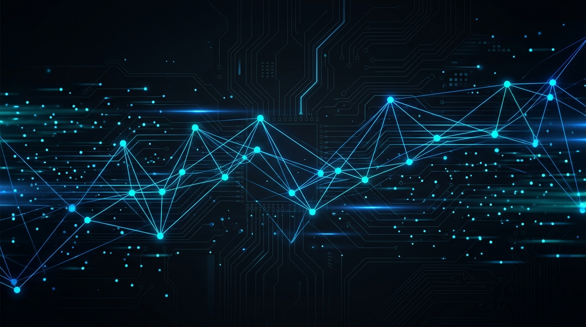

<!-- ════════════════════════════════════════════════════════════════════ -->
<!--     B LAXMI NARASIMHA REDDY — DEVELOPER DASHBOARD PROFILE        -->
<!-- ════════════════════════════════════════════════════════════════════ -->

 

# Hi, I'm Narasimha 👋
### Full Stack Developer · Aspiring AI Engineer

`Full Stack` &nbsp; `MERN` &nbsp; `AI/ML` &nbsp; `.NET` &nbsp; `Python`

 

---

## About Me

Full Stack Developer based in India, currently studying at **Nalla Narasimha Reddy Group of Institutions**. I build real-world applications using the MERN stack, Python, and .NET — and I'm working my way into AI and Machine Learning because that's where the future is heading.

I'm someone who doesn't do things halfway. When I sit down to work on something, I stay locked in until it's done right. Whether it's debugging a backend issue at 2 AM or learning a new framework from scratch, I bring the same level of focus to everything I do. Studies, projects, work — I treat them all with the same intensity.

I'm not just learning to land a job. I'm building skills because I want to **own a company** someday and create something that actually matters. That's the long game I'm playing.

---

## Featured Projects

<table>
<tr>
<td width="50%" valign="top">

### 🏨 AI-SmartStay
**AI-Powered Hostel Finder Platform**

A full-stack MERN application that helps students discover, compare, and book verified hostels using live GPS location and an intelligent recommendation engine.

- ✅ AI-powered hostel recommendations
- ✅ Live GPS-based location search
- ✅ User reviews & verified listings
- ✅ Real-time booking system

**Tech Stack:** `React` `Node.js` `MongoDB` `Express`

</td>
<td width="50%" valign="top">

### 🌾 Smart Agriculture
**IoT Solution for Hilly Regions**

A smart agriculture monitoring system designed specifically for farming in hilly terrain, using sensor data and predictive analytics to help farmers make better decisions.

- ✅ Real-time soil & weather monitoring
- ✅ Crop health predictions using ML
- ✅ Dashboard for farmers
- ✅ Alert system for extreme conditions

**Tech Stack:** `Python` `IoT` `Machine Learning`

</td>
</tr>
<tr>
<td width="50%" valign="top">

### 🧠 Smart Attendance System
**Automated Attendance Tracking**

A web-based smart attendance system that simplifies the way institutions track and manage student attendance with role-based access and analytics.

- ✅ Automated attendance recording
- ✅ Role-based access (admin/student)
- ✅ Attendance analytics & reports
- ✅ Clean, responsive dashboard

**Tech Stack:** `JavaScript` `Node.js` `MongoDB`

</td>
<td width="50%" valign="top">

### 🔍 Fake Review Detector
**ML-Powered Review Analysis**

A machine learning application that identifies and flags fake/suspicious product reviews to help users make genuine purchase decisions.

- ✅ NLP-based review analysis
- ✅ Fake vs genuine classification
- ✅ Confidence scoring
- ✅ Web interface for testing

**Tech Stack:** `Python` `HTML` `Machine Learning`

</td>
</tr>
</table>

---

## Tech Stack

#### Frontend Development
&nbsp;
&nbsp;
&nbsp;
&nbsp;
&nbsp;
&nbsp;

#### Backend Development
&nbsp;
&nbsp;
&nbsp;
&nbsp;

#### Database & DevOps
&nbsp;
&nbsp;
&nbsp;
&nbsp;
&nbsp;
&nbsp;
&nbsp;
&nbsp;

---

## GitHub Analytics

<table>
<tr>
<td width="50%" align="center">

</td>
<td width="50%" align="center">

</td>
</tr>
</table>

---

## Current Focus & Interests

🔭 &nbsp; Working on **AI-powered full stack applications**  
🌱 &nbsp; Learning **Machine Learning, Deep Learning & AI Engineering**  
🎯 &nbsp; Goal: **Build and run my own tech company**  
🎮 &nbsp; When offline: **Gaming & Cars** — two things I never get tired of  
💬 &nbsp; Ask me about **MERN, Python, .NET, or building stuff from scratch**  
📫 &nbsp; Reach me at **budhilreddy024@gmail.com**

---

## Trophies

---

## Contribution Snake

---

## Beyond Code

---

## Let's Connect 🤝

I'm always open to discussing new projects, creative ideas, or opportunities to be part of your vision.

 

> *"Dream big. Work hard. Stay consistent. Never quit."*

